# Rendu Docker 20-05-2026

## Lien VPS

- http://195.110.34.198:40110 (nginx)
- http://195.110.34.198:40130 (prometheus)
- http://195.110.34.198:40120 (grafana | admin:admin)
- https://195.110.34.198:40140 (portainer | admin:adminpassword)

## Partie 1 (API & Dockerfile)

### Fichiers
- [Dockerfile](Dockerfile)
- [./api](api)

## Partie 2 (Registry privé)

### Captures
`registry`
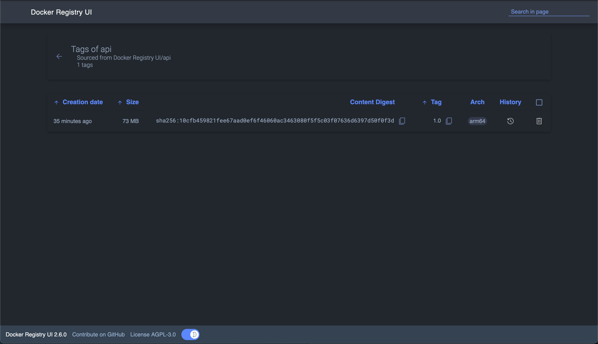

`docker-compose.yaml`
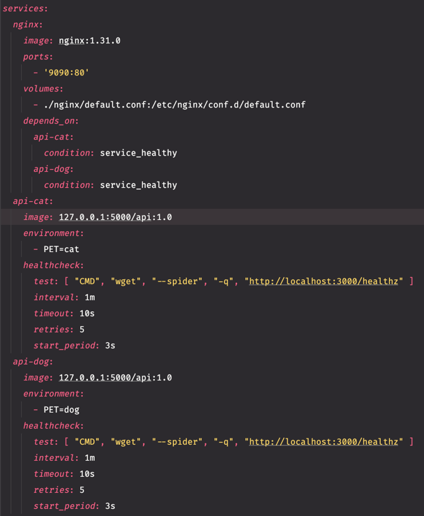

## Partie 3 (Stack Compose & Nginx)

### Fichiers

- [./nginx/default.conf](nginx/default.conf)

## Partie 4 (Sécurité)

### Questions

_Pourquoi `node:20-alpine `plutôt que `node:latest` ?_

`node:20-alpine` est plus légère, plus rapide à télécharger et contient moins de dépendances inutiles.

_Quel est l'impact sur le nombre de CVE ?_

Le nombre de CVE est réduit car l’image Alpine embarque moins de paquets et donc moins de vulnérabilités qui peuvent être détectées par **Trivy**.

### Captures

`trivy scan image`
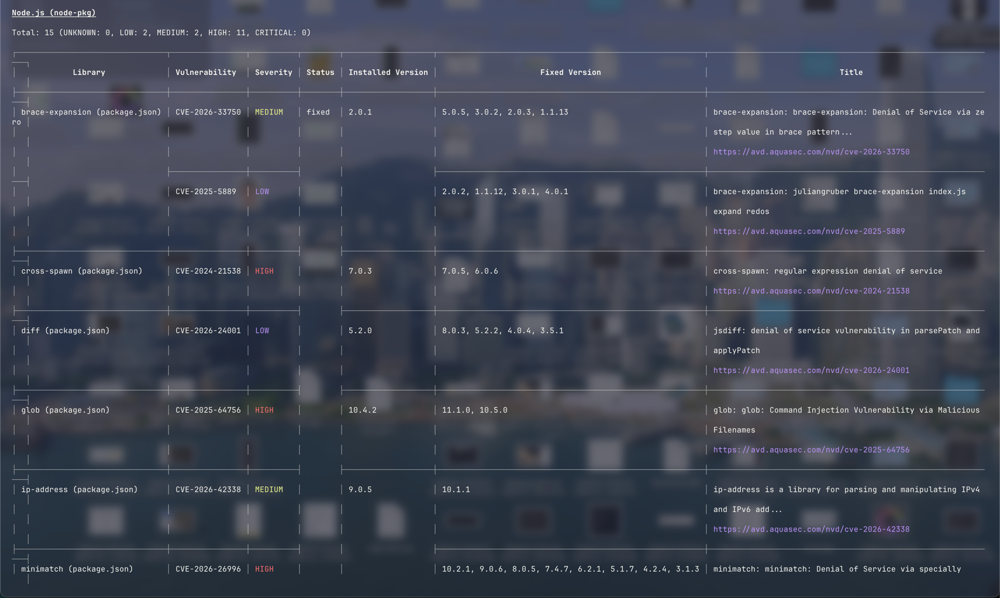

## Partie 5 (Validation de la stack)

### Captures

`docker compose ps`
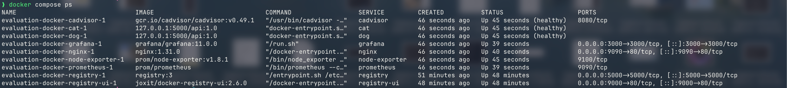

`/ (avec cat)`
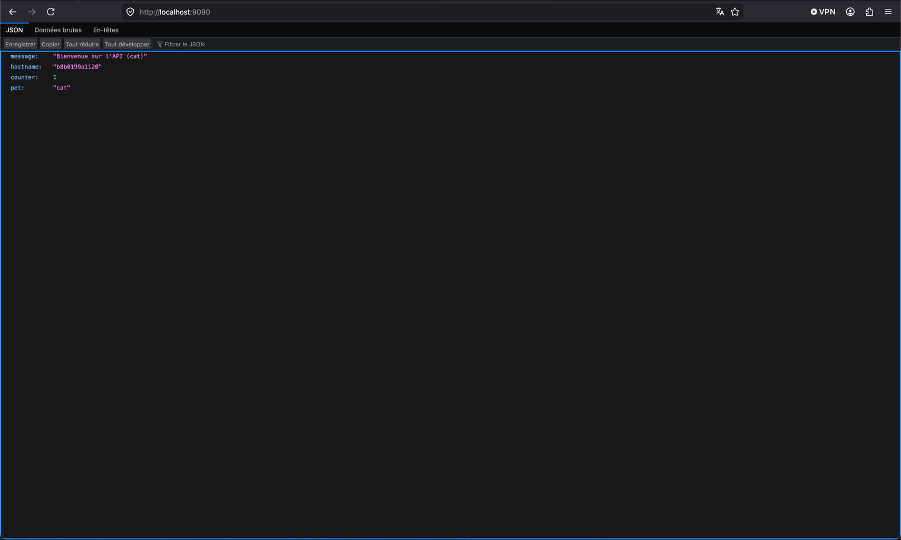

`/ (avec dog)`

`/cat`

`/dog`

## Partie 6 (Question)

_Expliquez la différence entre `docker compose up` et docker stack deploy. Pourquoi la directive `build`: n'est-elle pas utilisable dans une stack déployée en mode Swarm ?_

`docker compose up` lance des conteneurs localement alors que `docker stack deploy` déploie des services sur un cluster Docker Swarm.
Le build de fonctionne pas en Swarm car les images doivent déjà être build et push dans un registry.

_Expliquez la différence entre passer un mot de passe via une variable d'environnement et via un Docker Secret. Dans quel fichier le secret est-il accessible à l'intérieur du conteneur, et comment le lire depuis du code Node.js ?_

Une variable d’environnement est plus facilement lisible dans le conteneur alors qu’un Docker Secret est stocké de manière sécurisée.
Le secret est accessible dans `/run/secrets/<secret>` et peut être lu en **Node.js** avec `fs.readFileSync()`.

_Dans une architecture Docker en production, quels éléments faut-il impérativement sauvegarder pour pouvoir reconstruire entièrement la stack après une panne ? Distinguez ce qui est recréable automatiquement de ce qui est irremplaçable._

Il faut sauvegarder les données, bases de données.
Les images et conteneurs sont recréables automatiquement, mais les données persistantes sont irrécupérable si elles ne sont pas enregistré dans un volume.

## Partie 7

### Fichiers
- [./monitoring/grafana](monitoring/grafana)
- [./monitoring/prometheus/prometheus.yml](monitoring/prometheus/prometheus.yml)

### Captures

`Application metrics`
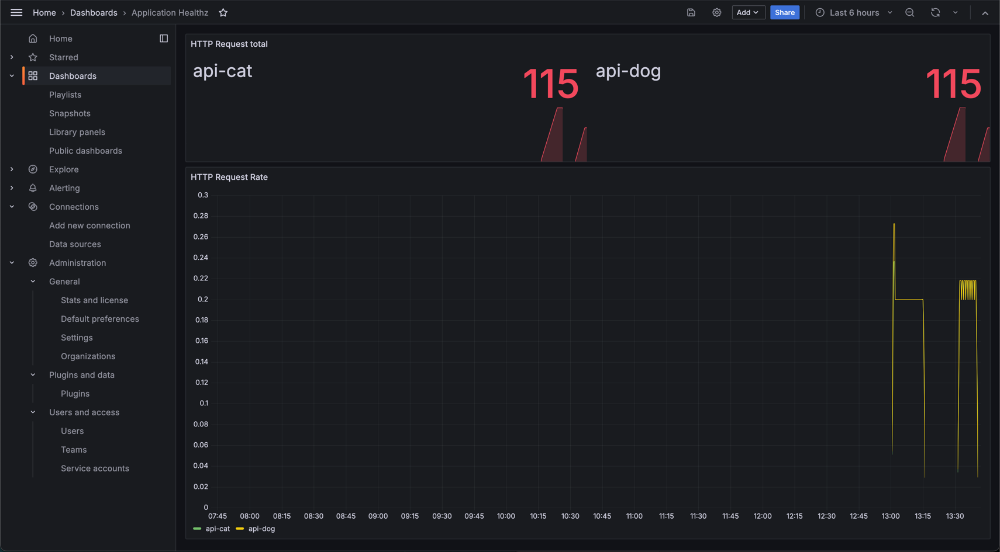

`cAdvisor`
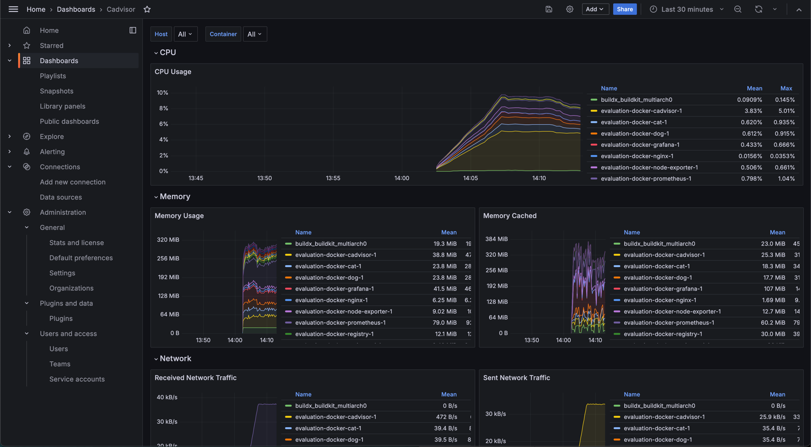

`Node Exporter`
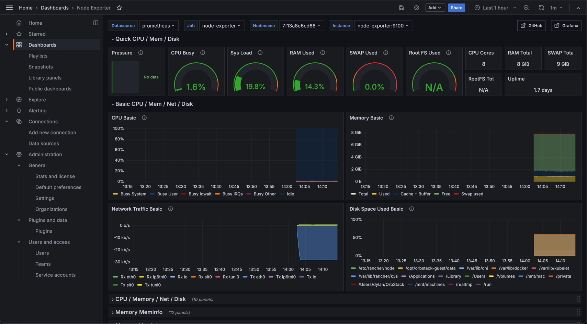

`Portainer.io`
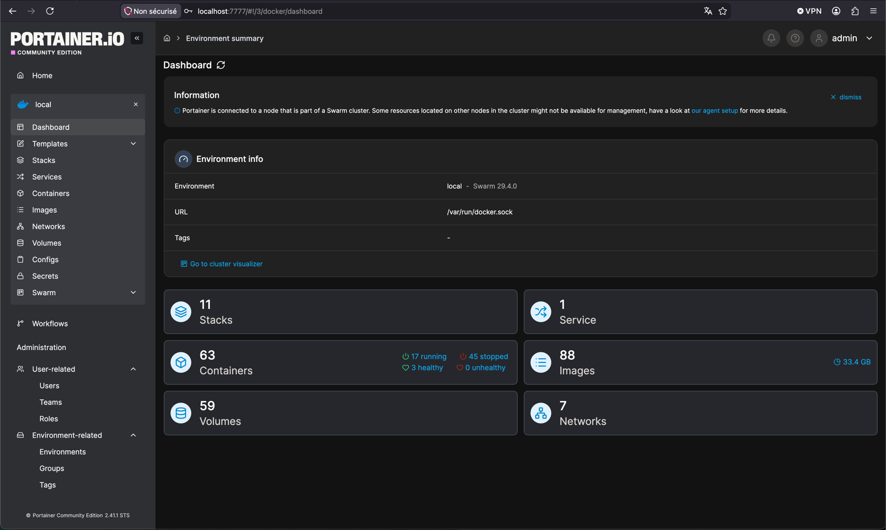

## Partie 8 (Volumes)

### Justification

Les volumes nommés sont utilisés pour les données persistantes comme Grafana et le registry, db, etc ... afin de conserver les données après la suppression des conteneurs.

Les bind mounts sont utilisés pour les fichiers de configuration, comme `prometheus.yml`, `default.conf` de Nginx et les fichiers de provisioning Grafana, afin de pouvoir les modifier facilement sans rebuild les images.

### Captures

`docker volume ls`
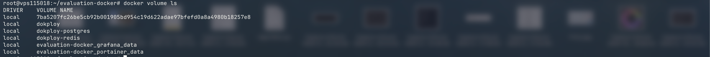

`docker volume inspect evaluation-docker_grafana_data`
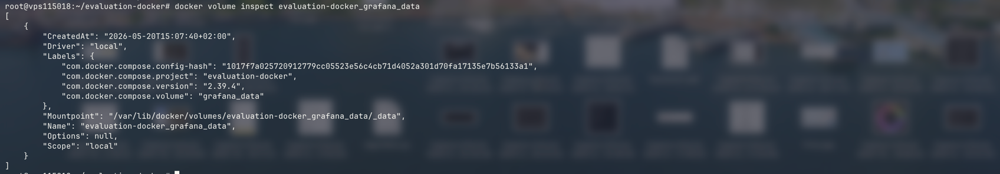

## Partie 9 (CI/CD avec GitHub Actions)

### Fichiers
[.github/workflows/docker.yml](.github/workflows/docker.yml)

### Captures

`Github Action`
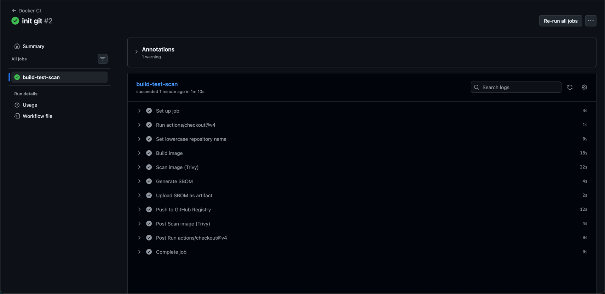